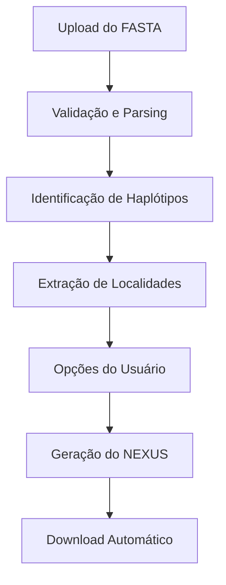

# Nexusficadorinator-inator™️

> _"Ah, Perry o Ornitorrinco! Vejo que você quer converter arquivos FASTA em NEXUS... MAS AGORA VOCÊ CAIU NA ARMADILHA DO MEU NEXUSFICADORINATOR-INATOR!"_

---

## 👨‍🔬 Introdução Maligna

Olá, cientistas malucos e agentes secretos disfarçados de mamíferos sem bico! Eu, Dr. Heinz Doofenshmirtz, apresento a você o **Nexusficadorinator-inator™️**: a solução definitiva para transformar seus arquivos FASTA em NEXUS, com direito a análise de haplótipos, distribuição geográfica e, claro, um toque de genialidade do mal!

Chega de perder tempo com scripts confusos ou softwares que só um gênio do mal entenderia. Aqui, tudo acontece direto do navegador, sem instalar nada.

---

## 🕹️ Como Usar (Plano Infalível)

1. **Prepare seu arquivo FASTA**

   - Nomeie suas sequências em um dos formatos abaixo:
     - `Nome-Localidade1`
     - `Nome-Localidade1-Localidade2`
   - Exemplo:
     ```
     >Perry-AreaDos3Estados
     ATCGATCGATCG...
     >Perry-AreaDos3Estados-Danville
     ATCGATCGATCG...
     ```

2. **Envie o arquivo**

   - Clique na área "Arraste seu arquivo FASTA aqui" ou no botão "Selecionar arquivo", ou arraste seu arquivo para a caixa de upload.
   - Aceita `.fas`, `.fasta`, `.fa` ou `.txt` (máx. 50MB).

3. **Confira o Resumo**

   - Veja quantas sequências, haplótipos e localidades foram detectados.
   - Se o nome não seguir o padrão, o Nexusficadorinator-inator não vai funcionar direito (e eu vou ficar frustrado).

4. **Escolha as Opções de Dominação**

   - **Modo Completo:** exporta todas as posições das sequências (para análises filogenéticas).
   - **Modo PopArt:** exporta só as posições variáveis (para redes de haplótipos).
   - **Distribuição geográfica:** adiciona o bloco TRAITS com as localidades.

5. **Tratamento de Posições Ambíguas**

   - Posições com N ou - são **automaticamente excluídas** da comparação de haplótipos.
   - As sequências originais (com N e -) são preservadas no arquivo NEXUS final.
   - Abordagem conservadora e cientificamente rigorosa!

6. **Gere o Arquivo NEXUS**

   - Clique em "Gerar arquivo NEXUS" e... BAM! O download começa.

7. **Novo Plano?**
   - Clique em "Novo arquivo" para recomeçar sua dominação científica.

---

## 🧪 Análise Técnica do Inator

### Tecnologias do Mal Utilizadas

- **HTML5 & CSS3**: Estrutura e visual moderno, responsivo e escuro (porque todo laboratório do mal é escuro).
- **JavaScript (Vanilla)**: Toda a lógica de conversão, análise e interação sem depender de frameworks (afinal, eu sou o framework!).
- **Ionicons**: Ícones modernos e leves para interface e botões.
- **Google Fonts (Inter)**: Tipografia elegante, porque até um vilão precisa de estilo.

### Como Funciona (Plano Maligno em Detalhes)

1. **Leitura do FASTA**

   - O usuário envia o arquivo.
   - O script lê e valida se todas as sequências têm o mesmo tamanho (alinhamento obrigatório!).

2. **Identificação de Haplótipos**

   - Identifica posições válidas: exclui automaticamente posições com N ou - em qualquer sequência.
   - Compara sequências apenas nas posições válidas.
   - Agrupa sequências idênticas em haplótipos únicos (H1, H2, H3...).
   - Conta quantas amostras existem de cada haplótipo.
   - **Importante:** As sequências originais (com N e -) são preservadas no arquivo NEXUS.

3. **Extração de Localidades**

   - Analisa o nome das sequências para extrair localidades (última ou penúltima parte do nome, conforme o padrão).
   - Gera matriz de distribuição para o bloco TRAITS.

4. **Tratamento Automático de Ambiguidades**

   - Posições com N ou - são automaticamente excluídas da comparação.
   - Abordagem conservadora: só compara posições com nucleotídeos válidos (A, T, C, G).
   - Exemplo: Sequência `ATNG-CTAG` → compara apenas posições 1, 2, 6, 7, 8, 9.

5. **Geração do NEXUS**

   - Monta o arquivo NEXUS com blocos TAXA, CHARACTERS e, se escolhido, TRAITS.
   - No modo PopArt, só sites variáveis são exportados, usando `.` para matches.
   - O arquivo é baixado automaticamente com nome inteligente.

6. **Interface do Mal**
   - Drag-and-drop, feedback visual, pré-visualização de dados, tudo para facilitar a vida do cientista (ou do agente secreto).

### Fluxo Resumido



---

## 🛠️ Tecnologias e Funcionalidades

| Tecnologia     | Função Principal                                |
| -------------- | ----------------------------------------------- |
| HTML5/CSS3     | Estrutura, responsividade, dark mode            |
| JavaScript     | Lógica de parsing, análise, geração de arquivos |
| Ionicons       | Ícones modernos e leves                         |
| Google Fonts   | Tipografia elegante                             |
| FileReader API | Leitura de arquivos no navegador                |
| Blob API       | Geração e download de arquivos                  |
| Flexbox/Grid   | Layout moderno                                  |
| Promises/Async | Interação fluida e sem travamentos              |

---

## 🤖 Considerações Finais do Dr. Doofenshmirtz

- O Nexusficadorinator-inator™️ foi projetado para ser à prova de agentes secretos e cientistas distraídos.
- Se algo der errado, a culpa é do Perry o Ornitorrinco (ou do alinhamento das suas sequências).
- Use, abuse e conquiste o mundo científico!

---

> _"Se ao menos eu tivesse tido isso na faculdade, talvez tivesse dominado o mundo... ou pelo menos passado em Genética Molecular!"_

---

Feito por BontempoWeb, com consultoria do Dr. Doofenshmirtz 😈
