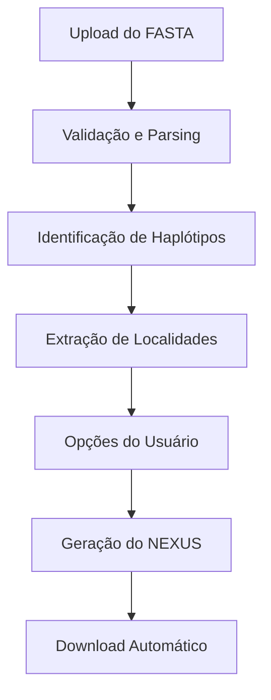
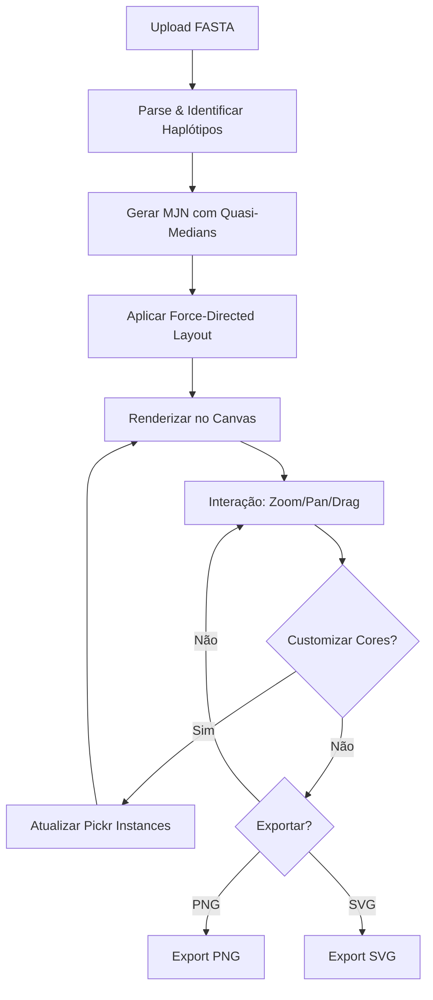

# Nexusficadorinator-inator™️

> _"Ah, Perry o Ornitorrinco! Vejo que você quer converter arquivos FASTA em NEXUS... MAS AGORA VOCÊ CAIU NA ARMADILHA DO MEU NEXUSFICADORINATOR-INATOR!"_

---

## 👨‍🔬 Introdução Maligna

Olá, cientistas malucos e agentes secretos disfarçados de mamíferos sem bico! Eu, Dr. Heinz Doofenshmirtz, apresento a você o **Nexusficadorinator-inator™️**: a solução definitiva para transformar seus arquivos FASTA em NEXUS, com direito a análise de haplótipos, distribuição geográfica e, claro, um toque de genialidade do mal!

Chega de perder tempo com scripts confusos ou softwares que só um gênio do mal entenderia. Aqui, tudo acontece direto do navegador, sem instalar nada.

---

## 🕹️ Como Usar (Plano Infalível)

1. **Prepare seu arquivo FASTA**

   - Nomeie suas sequências em um dos formatos abaixo:
     - `Nome-Localidade1`
     - `Nome-Localidade1-Localidade2`
   - Exemplo:
     ```
     >Perry-AreaDos3Estados
     ATCGATCGATCG...
     >Perry-AreaDos3Estados-Danville
     ATCGATCGATCG...
     ```

2. **Envie o arquivo**

   - Clique na área "Arraste seu arquivo FASTA aqui" ou no botão "Selecionar arquivo", ou arraste seu arquivo para a caixa de upload.
   - Aceita `.fas`, `.fasta`, `.fa` ou `.txt` (máx. 50MB).

3. **Confira o Resumo**

   - Veja quantas sequências, haplótipos e localidades foram detectados.
   - Se o nome não seguir o padrão, o Nexusficadorinator-inator não vai funcionar direito (e eu vou ficar frustrado).

4. **Escolha as Opções de Dominação**

   - **Modo Completo:** exporta todas as posições das sequências (para análises filogenéticas).
   - **Modo PopArt:** exporta só as posições variáveis (para redes de haplótipos).
   - **Distribuição geográfica:** adiciona o bloco TRAITS com as localidades.

5. **Tratamento de Posições Ambíguas**

   - Posições com N ou - são **automaticamente excluídas** da comparação de haplótipos.
   - As sequências originais (com N e -) são preservadas no arquivo NEXUS final.
   - Abordagem conservadora e cientificamente rigorosa!

6. **Gere o Arquivo NEXUS**

   - Clique em "Gerar arquivo NEXUS" e... BAM! O download começa.

7. **Novo Plano?**
   - Clique em "Novo arquivo" para recomeçar sua dominação científica.

---

## 🧪 Análise Técnica do Inator

### Tecnologias do Mal Utilizadas

- **HTML5 & CSS3**: Estrutura e visual moderno, responsivo e escuro (porque todo laboratório do mal é escuro).
- **JavaScript (Vanilla)**: Toda a lógica de conversão, análise e interação sem depender de frameworks (afinal, eu sou o framework!).
- **Ionicons**: Ícones modernos e leves para interface e botões.
- **Google Fonts (Inter)**: Tipografia elegante, porque até um vilão precisa de estilo.

### Como Funciona (Plano Maligno em Detalhes)

1. **Leitura do FASTA**

   - O usuário envia o arquivo.
   - O script lê e valida se todas as sequências têm o mesmo tamanho (alinhamento obrigatório!).

2. **Identificação de Haplótipos**

   - Identifica posições válidas: exclui automaticamente posições com N ou - em qualquer sequência.
   - Compara sequências apenas nas posições válidas.
   - Agrupa sequências idênticas em haplótipos únicos (H1, H2, H3...).
   - Conta quantas amostras existem de cada haplótipo.
   - **Importante:** As sequências originais (com N e -) são preservadas no arquivo NEXUS.

3. **Extração de Localidades**

   - Analisa o nome das sequências para extrair localidades (última ou penúltima parte do nome, conforme o padrão).
   - Gera matriz de distribuição para o bloco TRAITS.

4. **Tratamento Automático de Ambiguidades**

   - Posições com N ou - são automaticamente excluídas da comparação.
   - Abordagem conservadora: só compara posições com nucleotídeos válidos (A, T, C, G).
   - Exemplo: Sequência `ATNG-CTAG` → compara apenas posições 1, 2, 6, 7, 8, 9.

5. **Geração do NEXUS**

   - Monta o arquivo NEXUS com blocos TAXA, CHARACTERS e, se escolhido, TRAITS.
   - No modo PopArt, só sites variáveis são exportados, usando `.` para matches.
   - O arquivo é baixado automaticamente com nome inteligente.

6. **Interface do Mal**
   - Drag-and-drop, feedback visual, pré-visualização de dados, tudo para facilitar a vida do cientista (ou do agente secreto).

### Fluxo Resumido


```mermaid
flowchart TD
    A[Upload do FASTA] --> B[Validação e Parsing]
    B --> C[Identificação de Haplótipos]
    C --> D[Extração de Localidades]
    D --> E[Opções do Usuário]
    E --> F[Geração do NEXUS]
    F --> G[Download Automático]
```

---

## 🛠️ Tecnologias e Funcionalidades

| Tecnologia     | Função Principal                                |
| -------------- | ----------------------------------------------- |
| HTML5/CSS3     | Estrutura, responsividade, dark mode            |
| JavaScript     | Lógica de parsing, análise, geração de arquivos |
| Ionicons       | Ícones modernos e leves                         |
| Google Fonts   | Tipografia elegante                             |
| FileReader API | Leitura de arquivos no navegador                |
| Blob API       | Geração e download de arquivos                  |
| Flexbox/Grid   | Layout moderno                                  |
| Promises/Async | Interação fluida e sem travamentos              |

---

## 🕸️ Módulo de Redes de Haplótipos - Haplonet-Inator™️

### Visão Geral

O **Haplonet-Inator™️** é um módulo integrado que gera e visualiza **redes de haplótipos** (haplotype networks) diretamente no navegador usando o algoritmo **Median-Joining Network (MJN)** de Bandelt, Forster & Röhl (1999).

### Funcionalidades Principais

#### 🎨 Visualização Interativa

- **Canvas HTML5**: Renderização de alta performance com zoom, pan e arrastar nós
- **Cores Customizáveis**: Sistema completo de personalização de cores usando Pickr color picker
  - Cores por localidade geográfica
  - Cor de fundo do canvas
  - Cor das arestas (edges)
  - Cor dos vetores medianos
  - Cor das mutações/ticks
- **Atualização em Tempo Real**: Todas as alterações de cores refletem instantaneamente na rede

#### 🧬 Algoritmo Median-Joining Network (MJN)

- **Implementação Completa**: Baseado em Bandelt, Forster & Röhl (1999)
- **Quasi-Medians**: Geração automática de vetores medianos (median vectors) não observados
- **Refinamento Iterativo**: Máximo de 20 iterações para otimização da rede
- **Limpeza Automática**: Remove vértices obsoletos (grau < 2, não amostrados)

#### 📊 Layout e Física

- **Force-Directed Layout**: Algoritmo de Tunkelang para posicionamento automático dos nós
- **Forças Implementadas**:
  - Repulsão entre nós (evita sobreposição)
  - Atração por arestas (mantém nós conectados juntos)
  - Forças de borda (mantém rede dentro dos limites)
- **Convergência Inteligente**: Para automaticamente quando a rede estabiliza
- **Reset de Layout**: Restaura posição original dos nós

#### 🎯 Representação Visual

- **Nós de Haplótipos**:
  - Tamanho proporcional ao número de amostras (√count)
  - Label interno com identificador (H1, H2, H3...)
  - Cor sólida para localidade única
  - Gráfico de pizza (pie chart) para múltiplas localidades
- **Vetores Medianos**:
  - Nós pequenos vazios (6px)
  - Representam haplótipos inferidos (não observados)
  - Conectam haplótipos distantes
- **Arestas**:
  - Espessura 2px
  - Exibição opcional de mutações (número ou ticks perpendiculares)
- **Tooltips Interativos**:
  - Mostram amostras, contagem e distribuição geográfica
  - Aparecem ao passar o mouse sobre os nós

#### 🎨 Sistema de Cores

- **Pickr Color Picker**: Biblioteca moderna com tema Monolith
- **Cores Default**:
  - Background: Transparente (rgba(255,255,255,0))
  - Edges: Cinza escuro (#1e293b)
  - Median vectors: Cinza médio (#64748b)
  - Mutations: Laranja (#f97316)
  - Localidades: Paleta de 9 cores vibrantes
- **Persistência**: Cores customizadas mantidas durante a sessão

#### 📤 Exportação

- **PNG Export**: Exporta a rede completa em alta resolução
  - Calcula bounds automáticos
  - Padding de 50px
  - API moderna showSaveFilePicker com fallback
- **SVG Export**: Exporta como vetor escalável
  - Texto renderizado corretamente
  - Suporte a gráficos de pizza
  - Ideal para publicações científicas

#### 🖱️ Interação

- **Arrastar Nós**: Clique e arraste qualquer nó para reposicioná-lo
- **Pan**: Clique e arraste no canvas vazio para mover a visualização
- **Zoom**: Scroll do mouse para aumentar/diminuir (0.1x - 5x)
- **Hover**: Passe o mouse sobre nós para ver detalhes

#### 📋 Estatísticas

- **Contadores Automáticos**:
  - Número de nós (haplótipos observados + medianos)
  - Número de arestas (conexões)
  - Número de componentes (subgrafos desconectados)

### Formatos de Entrada Suportados

- **FASTA** (.fas, .fasta, .fa, .txt)
  - Formato padrão de sequências
  - Nomes devem seguir padrão: `Nome-Localidade` ou `Nome-Loc1-Loc2`

### Tecnologias do Haplonet-Inator™️

| Tecnologia           | Função                                  |
| -------------------- | --------------------------------------- |
| Canvas 2D API        | Renderização de alta performance        |
| Pickr v1.8.x         | Color picker avançado com tema monolith |
| Force-Directed Graph | Layout automático (Tunkelang)           |
| Median-Joining Net   | Algoritmo de rede de haplótipos (MJN)   |
| File Picker API      | Salvar arquivos com diálogo nativo      |
| Blob API             | Geração de PNG/SVG                      |
| ResizeObserver       | Canvas responsivo                       |

### Fluxo do Haplonet-Inator™️


```mermaid
flowchart TD
    A[Upload FASTA] --> B[Parse & Identificar Haplótipos]
    B --> C[Gerar MJN com Quasi-Medians]
    C --> D[Aplicar Force-Directed Layout]
    D --> E[Renderizar no Canvas]
    E --> F[Interação: Zoom/Pan/Drag]
    F --> G{Customizar Cores?}
    G -->|Sim| H[Atualizar Pickr Instances]
    H --> E
    G -->|Não| I{Exportar?}
    I -->|PNG| J[Export PNG]
    I -->|SVG| K[Export SVG]
    I -->|Não| F
```

### Considerações Científicas

- **Precisão Algorítmica**: Implementação fiel ao paper original do MJN
- **Performance**: Otimizado para datasets de até 100 haplótipos
- **Ambiguidades**: Posições com N ou - são excluídas automaticamente
- **Publicação**: Exportação em SVG permite edição vetorial para papers

---

## 🤖 Considerações Finais do Dr. Doofenshmirtz

- O Nexusficadorinator-inator™️ foi projetado para ser à prova de agentes secretos e cientistas distraídos.
- Se algo der errado, a culpa é do Perry o Ornitorrinco (ou do alinhamento das suas sequências).
- Use, abuse e conquiste o mundo científico!

---

> _"Se ao menos eu tivesse tido isso na faculdade, talvez tivesse dominado o mundo... ou pelo menos passado em Genética Molecular!"_

---

Feito por BontempoWeb, com consultoria do Dr. Doofenshmirtz 😈
